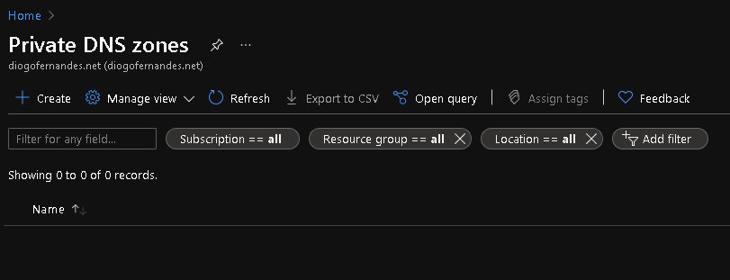
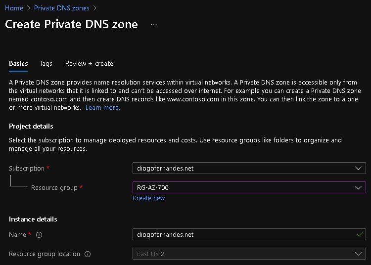
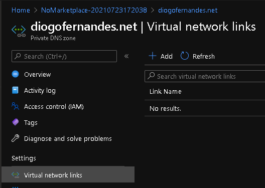
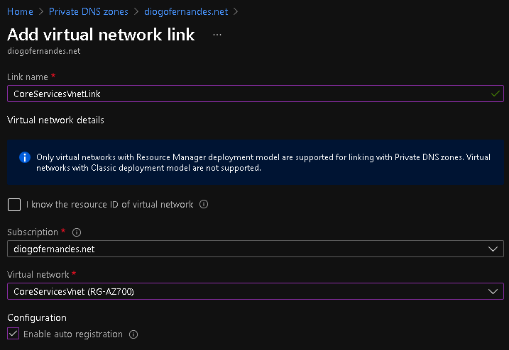
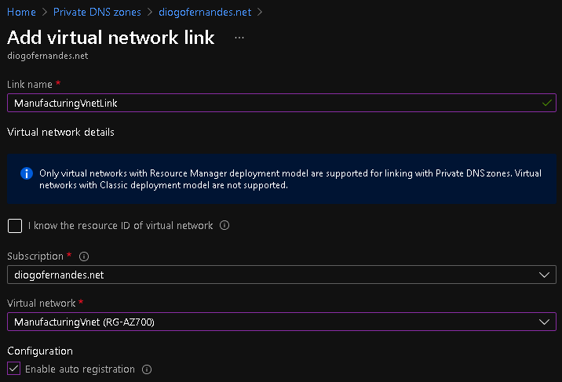
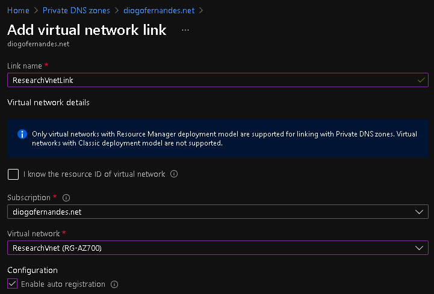
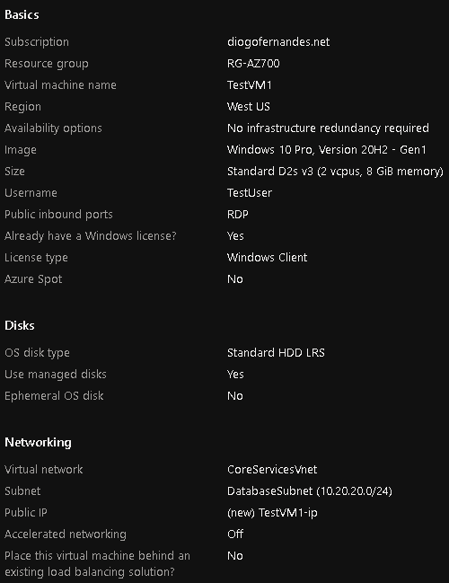

- [ ] design public DNS zones
- [ ] design private DNS zones
- [ ] design name resolution inside a VNet
- [ ] configure a public or private DNS zone
- [ ] link a private DNS zone to a VNet


- Task 1: Create a private DNS Zone
- Task 2: Link subnet for auto registration
- Task 3: Create Virtual Machines to test the configuration
- Task 4: Verify records are present in the DNS zone


# Task 1: Create a private DNS Zone

1. Go to [Azure Portal](https://portal.azure.com/).
2. On the Azure home page, in the search bar, type dns, and then select **Private DNS zones**.



1. In Private DNS zones, select **+ Create**.



1. Wait until the deployment is complete, and then select **Go to resource**.
2. Verify that the zone has been created.

# Task 2: Link subnet for auto registration


1. In diogofernandes.net, under **Settings**, select **Virtual network links**.
2. On diogofernandes.net	Virtual network links, select + Add.








1. Select **Refresh**.
2. Verify that the CoreServicesVnetLink has been created, and that auto-registration is enabled.
3. Repeat steps 2 - 5 for the ManufacturingVnet, using the information in the following table:







# Task 3: Create Virtual Machines to test the configuration


In this section, you will create two test VMs to test the Private DNS zone configuration.




### Create TestVM2

1. On the Azure home page, select **Virtual Machines**.
2. In Virtual Machines, select **+ Add > + Start with a preset configuration**.


Congratulations! You have created a private DNS Zone, added a name resolution and auto-registration link, and tested name resolution in your configuration.


```powershell
$TAG_RG = Get-AzResourceGroup -Name $resourceGroupName -ErrorVariable notPresent -ErrorAction SilentlyContinue
if ($TAG_RG -eq $null) {
    Write-Host -ForegroundColor Green "Tagging Resource Group of the.................................:" $rgName
    Update-AzTag -Tag $tags_rg -ResourceId $((Get-AzResourceGroup -Name $rgName).ResourceId) -Operation $OPERATION  
}
    # Create RG if not Exist
    Write-Host "Create Resource Group: $resourceGroupName" -ForegroundColor Cyan
    New-AzResourceGroup -Name $resourceGroupName -Location $region -Tag $tags_rg

$rg = @{
    Name = 'RG-AZ700'
    Location = 'EastUS'
}
New-AzResourceGroup @rg

```
