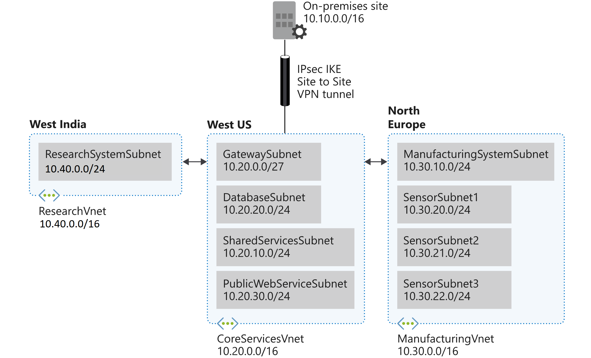

# Private IP addressing for VNets

## Design and implement private IP addressing for VNets
- [X ] create a VNet
- [ ] plan and configure subnetting for services, including VNet gateways, private endpoints, 
firewalls, application gateways, and VNet-integrated platform services
- [ ] plan and configure subnet delegation


## Tabela de Recursos

| **Virtual Network** | **Region** | **Address Space** | **Subnet Name**                | **Subnet Address**    |
| :------------------ | :--------- | :-------------------------------- | :------------------------ | :------------ |
| vnet-core-us        | EastUS     | 10.20.0.0/16                      |                           |               |
|                     |            |                                   | GatewaySubnet             | 10.20.0.0/27  |
|                     |            |                                   | SN-SharedServices         | 10.20.10.0/24 |
|                     |            |                                   | SN-Databases              | 10.20.20.0/24 |
|                     |            |                                   | SN-PublicWebService       | 10.20.30.0/24 |
| vnet-fabric-west    | WestUS     | 10.30.0.0/16                      |                           |               |
|                     |            |                                   | ManufacturingSystemSubnet | 10.30.10.0/24 |
|                     |            |                                   | SensorSubnet1             | 10.30.20.0/24 |
|                     |            |                                   | SensorSubnet2             | 10.30.21.0/24 |
|                     |            |                                   | SensorSubnet3             | 10.30.22.0/24 |
| vnet-dev-central    | CentralUS  | 10.40.0.0/16                      |                           |               |
|                     |            |                                   | ResearchSystemSubnet      | 10.40.0.0/24  |


## Diagrama





### Criação das VNETs via Powershell


***
Script powershell para criação do cenario proposto:

* Vamos criar apenas um Resource Group para facilitar a vizualização dos recursos criados 


```powershell
# Crianção de RG
$rg = @{
    Name = 'RG-AZ700'
    Location = 'EastUS'
}
New-AzResourceGroup @rg
```


!!! Core "Criação das vNets"

    === "CoreServicesVnet"
    
        ```powershell
        # Crianção da vNet
        $vnet = @{
            Name = 'CoreServicesVnet'
            ResourceGroupName = $rg.Name
            Location = 'West US'
            AddressPrefix = '10.20.0.0/16'    
        }
        $virtualNetwork = New-AzVirtualNetwork @vnet
        
        # Crianção das Subnets
        $subnet1 = @{
            Name = 'GatewaySubnet'
            VirtualNetwork = $virtualNetwork
            AddressPrefix = '10.20.0.0/27'
        }
        $subnetConfig = Add-AzVirtualNetworkSubnetConfig @subnet1
        $subnet2 = @{
            Name = 'SharedServicesSubnet'
            VirtualNetwork = $virtualNetwork
            AddressPrefix = '10.20.10.0/24'
        }
        $subnetConfig = Add-AzVirtualNetworkSubnetConfig @subnet2
        $subnet3 = @{
            Name = 'DatabaseSubnet'
            VirtualNetwork = $virtualNetwork
            AddressPrefix = '10.20.20.0/24'
        }
        $subnetConfig = Add-AzVirtualNetworkSubnetConfig @subnet3
        $subnet4 = @{
            Name = 'PublicWebServiceSubnet'
            VirtualNetwork = $virtualNetwork
            AddressPrefix = '10.20.30.0/24'
        }
        $subnetConfig = Add-AzVirtualNetworkSubnetConfig @subnet4
        # Associar subnet a vNet
        $virtualNetwork | Set-AzVirtualNetwork
        ```
    === "ManufacturingVnet"
    
        ```powershell
        # Crianção da vNet
        $vnet = @{
            Name = 'ManufacturingVnet'
            ResourceGroupName = $rg.Name
            Location = 'North Europe'
            AddressPrefix = '10.30.0.0/16'    
        }
        $virtualNetwork = New-AzVirtualNetwork @vnet
        
        # Crianção das Subnets
        $subnet1 = @{
            Name = 'ManufacturingSystemSubnet'
            VirtualNetwork = $virtualNetwork
            AddressPrefix = '10.30.10.0/24'
        }
        $subnetConfig = Add-AzVirtualNetworkSubnetConfig @subnet1
        $subnet2 = @{
            Name = 'SensorSubnet1'
            VirtualNetwork = $virtualNetwork
            AddressPrefix = '10.30.20.0/24'
        }
        $subnetConfig = Add-AzVirtualNetworkSubnetConfig @subnet2
        $subnet3 = @{
            Name = 'SensorSubnet2'
            VirtualNetwork = $virtualNetwork
            AddressPrefix = '10.30.21.0/24'
        }
        $subnetConfig = Add-AzVirtualNetworkSubnetConfig @subnet3
        $subnet4 = @{
            Name = 'SensorSubnet3'
            VirtualNetwork = $virtualNetwork
            AddressPrefix = '10.30.22.0/24'
        }
        $subnetConfig = Add-AzVirtualNetworkSubnetConfig @subnet4
        # Associar subnet a vNet
        $virtualNetwork | Set-AzVirtualNetwork
        ```
    === "ResearchVnet"
    
        ```powershell
        # Crianção da vNet
        $vnet = @{
            Name = 'ResearchVnet'
            ResourceGroupName = $rg.Name
            Location = 'West India'
            AddressPrefix = '10.40.0.0/16'    
        }
        $virtualNetwork = New-AzVirtualNetwork @vnet
        
        # Crianção das Subnets
        $subnet1 = @{
            Name = 'ResearchSystemSubnet'
            VirtualNetwork = $virtualNetwork
            AddressPrefix = '10.40.0.0/24'
        }
        $subnetConfig = Add-AzVirtualNetworkSubnetConfig @subnet1
        # Associar subnet a vNet
        $virtualNetwork | Set-AzVirtualNetwork
        ```
